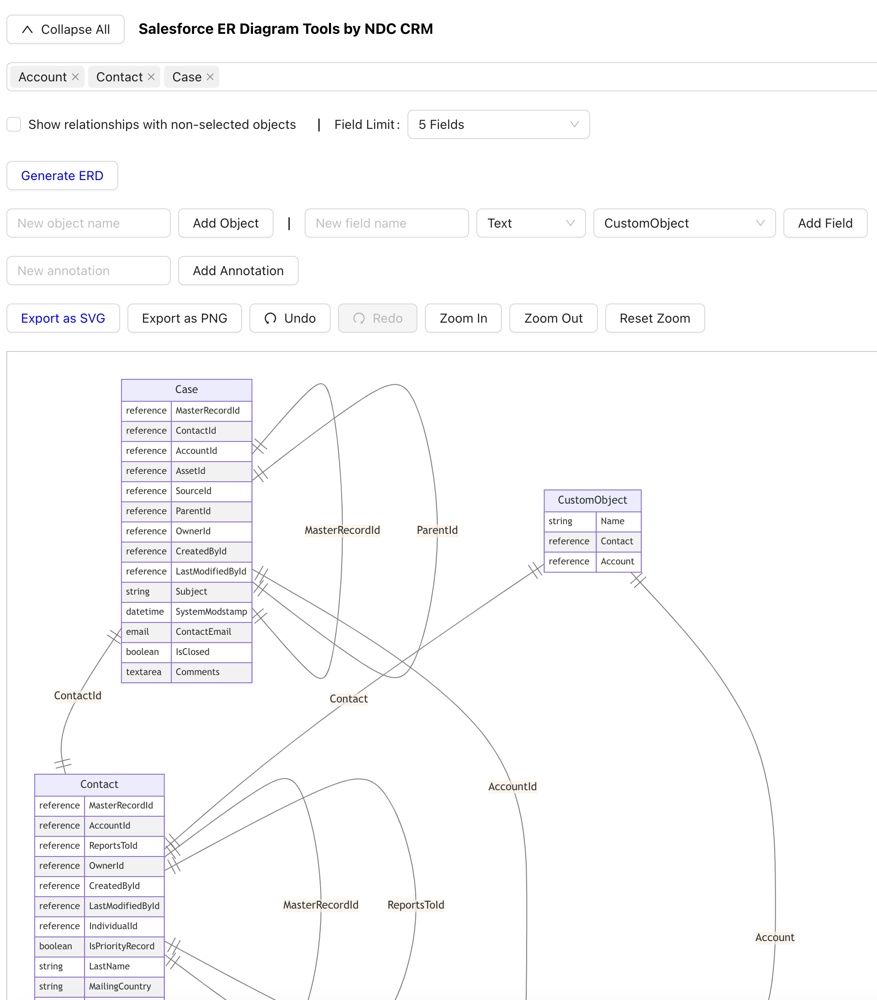

# Salesforce ER Diagram Generator

:wave: Hi,

The salesforce native ERD tool is powerful but lacks the ability to export SVG or PNG. So for my PPT porpuses, I created this tool to generate ERD diagrams for Salesforce objects.

This repo is a web-based application built with Flask for the backend and React for the frontend. The application allows users to log in to their Salesforce account, select objects, and generate Entity-Relationship Diagrams (ERDs) based on the selected objects. The diagrams can be exported as SVG or PNG files.

:coffee: CI/CD Status:


## Table of Contents

- [Salesforce ER Diagram Generator](#salesforce-er-diagram-generator)
  - [Table of Contents](#table-of-contents)
  - [Features](#features)
  - [Prerequisites](#prerequisites)
  - [Installation](#installation)
    - [Backend (Flask)](#backend-flask)
    - [Frontend (Optional) For Development](#frontend-optional-for-development)
    - [Usage](#usage)
    - [Use Docker](#use-docker)
    - [Logging In](#logging-in)
    - [Generating ER Diagrams](#generating-er-diagrams)
  - [Screenshot](#screenshot)
  - [To Do](#to-do)
  - [License](#license)

## Features

- Login to Salesforce using Production, Sandbox, or Custom domains.
- Fetch and select standard and custom Salesforce objects.
- Generate ER Diagrams with a configurable number of fields per object.
- Display relationships between selected objects.
- Export diagrams as SVG or PNG files.
- Option to add custom objects, fields, and annotations to the diagram.

## Prerequisites

- Python 3.9 or higher
- Node.js 14 or higher
- Salesforce account with API access

## Installation

### Backend (Flask)

1. Clone the repository:

    ```bash
        git clone https://github.com/unizhu/salesforce-erd-generator.git
        cd salesforce-erd-generator
    ```

2. Create a virtual environment and install the required packages:

    2.1 Conda Command:

    ```bash
        conda create --name salesforce-erd-generator python=3.9
        conda activate salesforce-erd-generator
        pip install -r requirements.txt
    ```

    2.2 Virtualenv Command:

    ```bash
        python -m venv salesforce-erd-generator
        source salesforce-erd-generator/bin/activate
        pip install -r requirements.txt
    ```

3. Install the required Python packages:

    ```bash
        pip install -r requirements.txt
    ```

### Frontend (Optional) For Development

```bash
    cd frontend
    npm install
    npm run build # npm start
```

### Usage

Running the Application
Start the Flask backend:

```bash
    python app.py
```

The backend server will start on [http://localhost:8082](http://localhost:8082).

Access the application in your web browser by navigating to:

```bash
    http://localhost:8082
```

### Use Docker

1. Pull & Run the Docker Image:

    ```bash

        docker pull unizhu/salesforce-erd-generator

        docker run -p 8082:8082 --name sf-erd-generator-container unizhu/salesforce-erd-generator
        
    ```

2. Access the application in your web browser by navigating to:

    ```bash
        http://localhost:8082
    ```

### Logging In

- Select your Salesforce environment (Production, Sandbox, Custom).
- Enter your Salesforce username, password, and security token (if applicable).
- Click Login to authenticate.
  
### Generating ER Diagrams

- After logging in, select the Salesforce objects you want to include in the ER Diagram.
- Set the field limit (5, 10, 20, or all fields).
- Click Generate ERD to create the diagram.
- Use the Export as SVG or Export as PNG buttons to download the diagram.

## Screenshot



## To Do

- [ ] Add support for oAuth Login.
- [ ] Automatically re-generate ERD when fields limit is changed.
- [ ] Fix Add Custom Object/Field with undo/redo bugs.

## License

This project is licensed under the GNU General Public License v3.0 (GPLv3). - see the [LICENSE](LICENSE) file for details.
